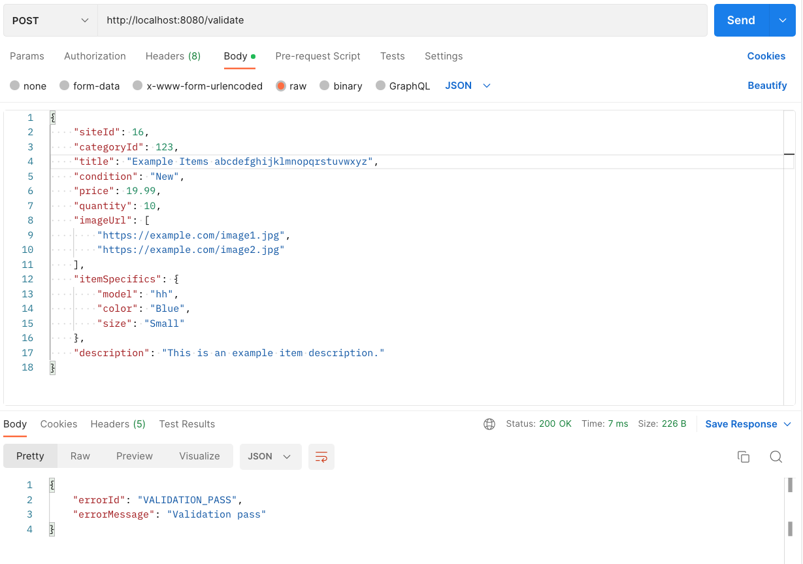
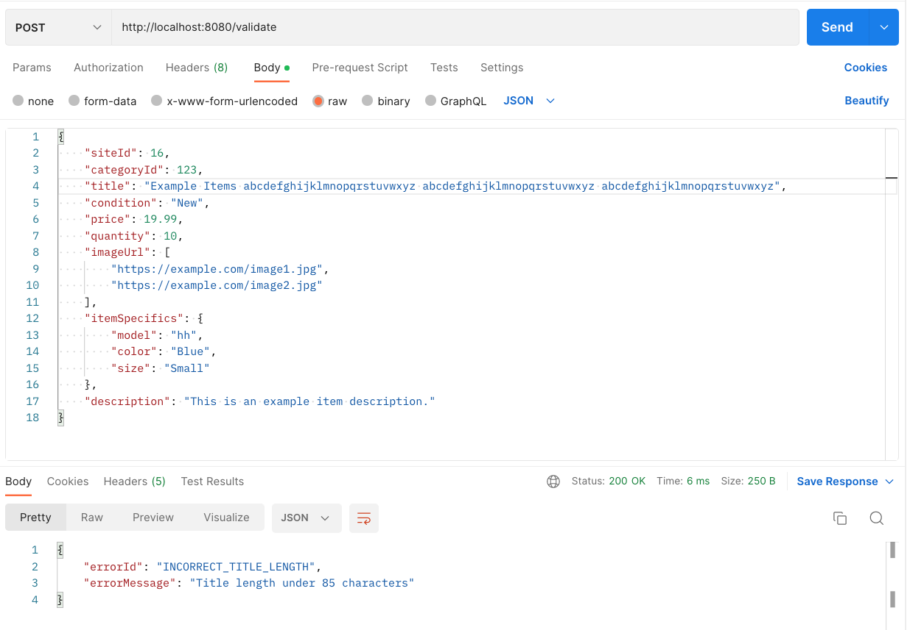
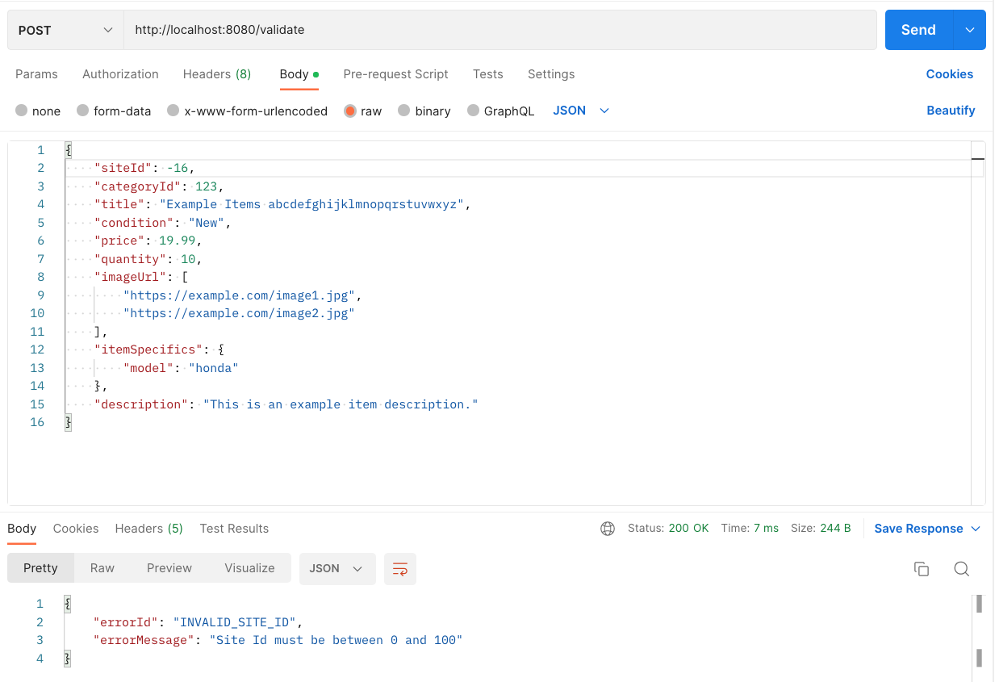
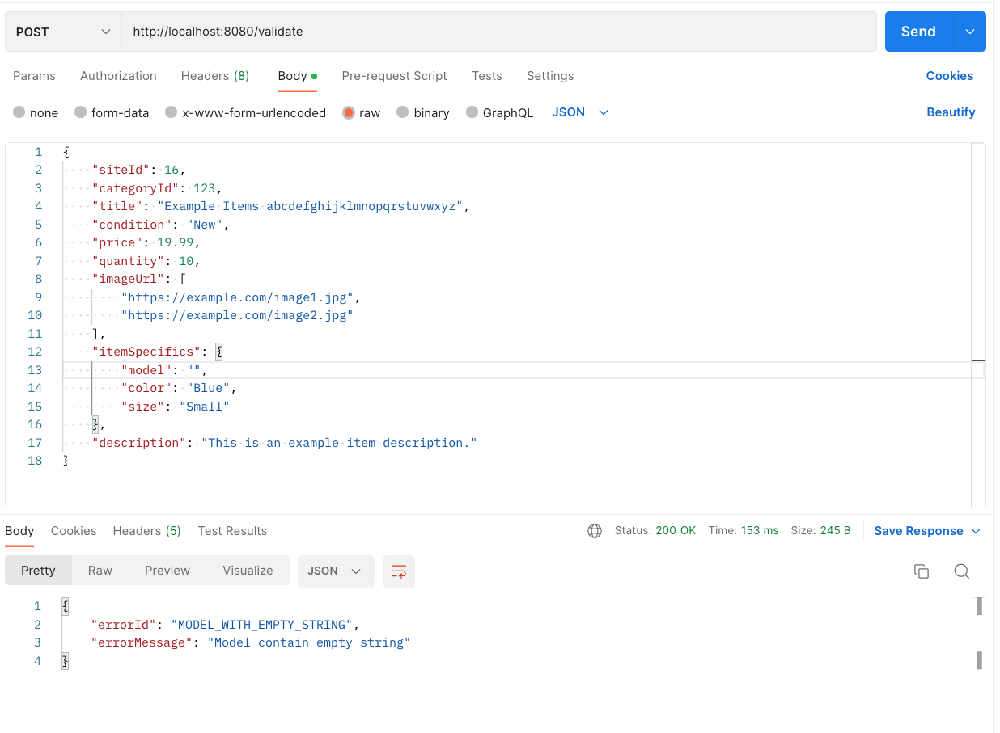
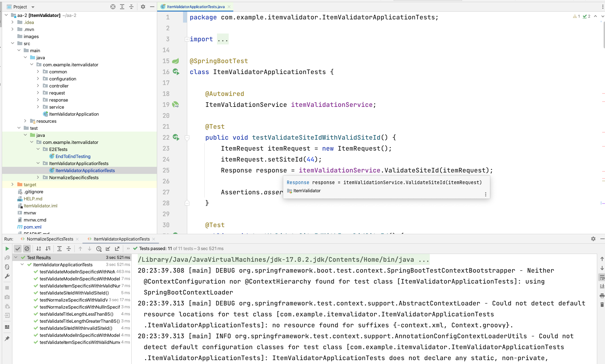
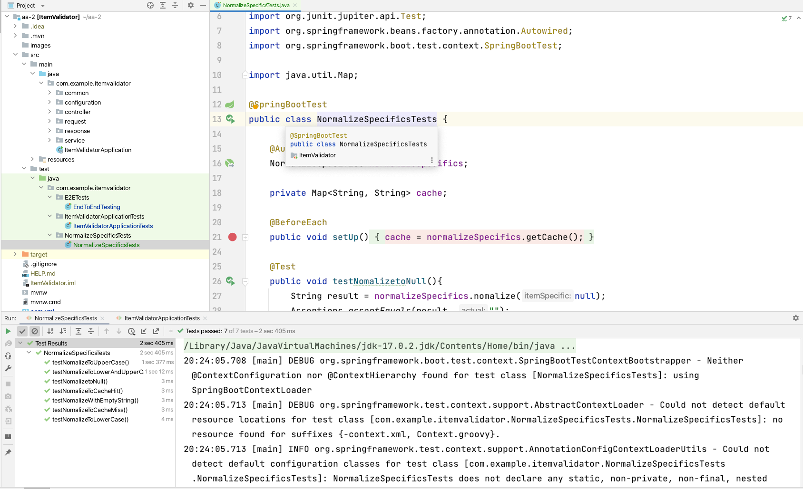
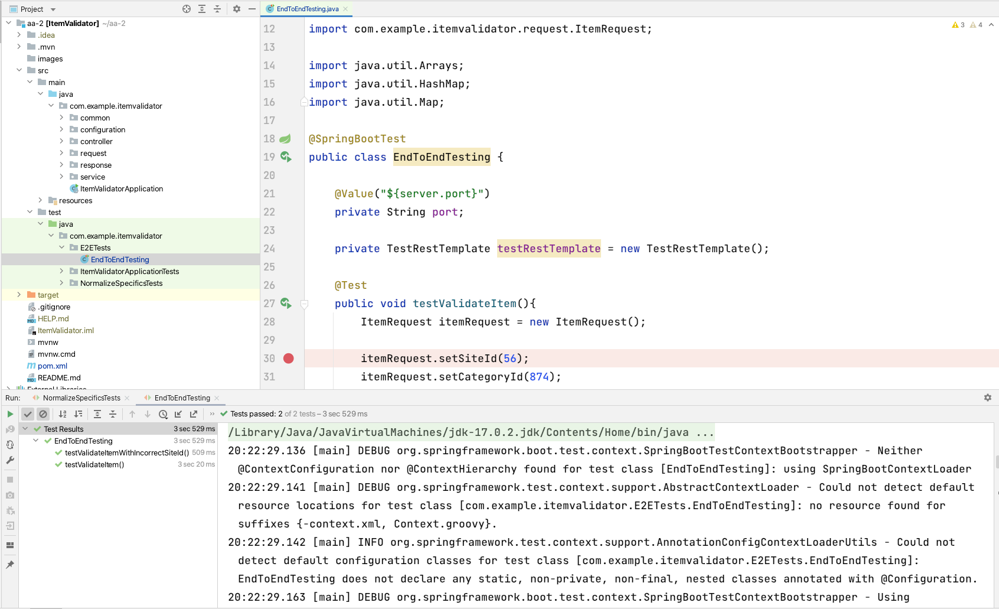

# ItemValidator

Run the application in IDE or in command line
mvn spring-boot:run

Validation pass

Incorrect title length

Incorrect items in specifics

Invalid site id

Model with empty string in specifics

Model missing in specifics

Item validator unit tests

Unit test for normalization

Unit test for E2E
